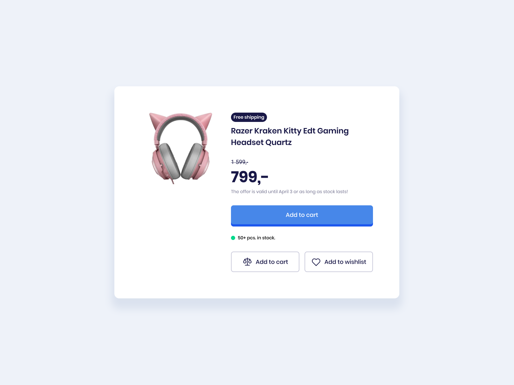
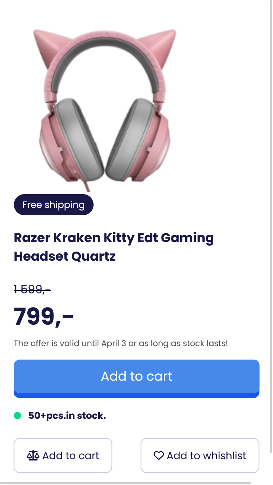
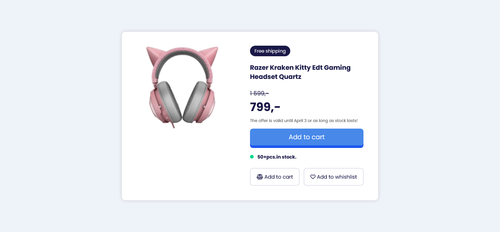

# Product Info - Solution



Esta es una solución del proyecto **Product Info** como parte del reto de codificación #100DaysOfProjects. La mejor manera de escribir un buen código es programando todos los días🔥.

## Tabla de contenidos

- [Vision general](#vision-general)
  - [El desafio](#el-desafio)
  - [Capturas de pantalla](#capturas-de-pantalla)
  - [Enlaces](#enlaces)
- [Proceso de trabajo](#proceso-de-trabajo)
  - [Desarrollo](#desarrollo)
  - [Lo que aprendimos](#lo-que-aprendimos)
  - [Lo que aprenderemos](#lo-que-aprenderemos)
  - [Recursos](#recursos)
- [Autor](#autor)
- [Agradecimientos](#agradecimientos)

## Vision general

### El desafio

Se requiere desarrollar una tarjeta de producto con los datos que se visualizan en el diseño, usando HTML y CSS.

1. La tarjeta debe incorporar la imagen del producto.
2. La tarjeta del producto de incluir una sombra de fondo.
3. La estructura y posición de los elementos debe ser lo más similar a la imagen.

### Capturas de pantalla

Diseño adaptado para cualquier tipo de pantalla del dispositivo:




### Enlaces

El proyecto se encuentra alojado en un hosting gratuito(Netlify):

- [Pagina web]()
- [Codigo fuente]()
- [Codepen](https://codepen.io/frontend-club/pen/OJqRxVp)

## Proceso de trabajo

### Desarrollo

- Marcado HTML
- Propiedades CSS
- Propiedad `grid`
- Media query

### Lo que aprendimos

Nuevamente procuramos usar la [metodologia BEM](https://getbem.com/introduction/) para ser más administrable el marcado HTML.

```html
<main class="container">
  <article class="card">
    <div class="card__header">
      <div class="card--img"></div>
    </div>
    <div class="card__body"></div>
    <div class="card__footer"></div>
  </article>
</main>
```

Usamos `media query` para adaptar el diseño a pantallas pequeñas:

```css
/* ----- Media queries ----- */
@media screen and (max-width: 1080px) {
  .card {
    width: 90%;
    grid-template-columns: 1fr;
  }
}
```

### Lo que aprenderemos

Aprenderemos más sobre el concepto _mobile-first_ para usar correctamente las propiedades CSS.

### Recursos

Hemos recopilado una lista de recursos e información valiosa que puede ayudarte a comprender mejor la realización de este hermoso proyecto:

- [UI Design Daily](https://www.uidesigndaily.com/) - contiene diseños UI de excelente calidad para codificar.
- [Google Fonts](https://fonts.google.com/) - contiene fuentes que podemos descargar y usar para nuestros proyectos.
- [BEM Methodology In CSS: A Quick Start Guide](https://scalablecss.com/bem-quickstart-guide/) - una guía corta pero precisa para comprender la metología BEM. Puedes descargar la guí en PDF.

## Autor

Nuestro canales sociales para saber más sobre los contenidos e ideas que compartimos en la comunidad:

- [Facebook](https://www.facebook.com/frontendclubfb)
- [Instagram](https://www.instagram.com/frontendclubig/)
- [LinkedIn](https://www.linkedin.com/in/frontendclub/)
- [Tik Tok](https://www.tiktok.com/@frontendclub)
- [Twitch](https://www.twitch.tv/frontendclub)
- [Blog](https://frontend-club.bullet.site/)
- [Grupo de WhastApp](https://chat.whatsapp.com/EJR1TBWu1Pc6Gz33i2mASa)
- [Grupo de Facebook](https://www.facebook.com/groups/100daysofprojects)
- [Dev TO](https://dev.to/frontendclub)
- [Codepen](https://codepen.io/frontend-club)

## Agradecimientos

Agradecemos a los miembros de la comunidad **Frontend Club**, que nos inspiran a seguir creando contenido y compartiendo iniciativas para ayudar a mejorar sus habilidades en HTML, CSS, JavaScript y Git.

2024, nuestro año.🔥

> “Yo puedo hacer cosas que tú no puedes, tú puedes hacer cosas que yo no puedo; juntos podemos hacer grandes cosas”. — Madre Teresa de Calcuta.
